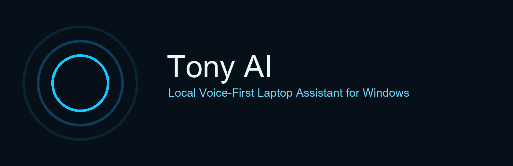
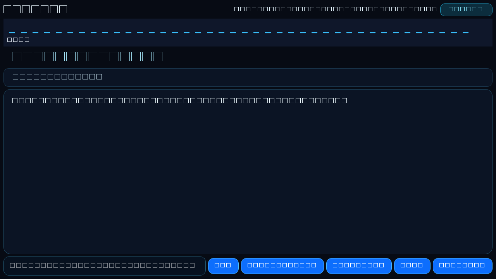
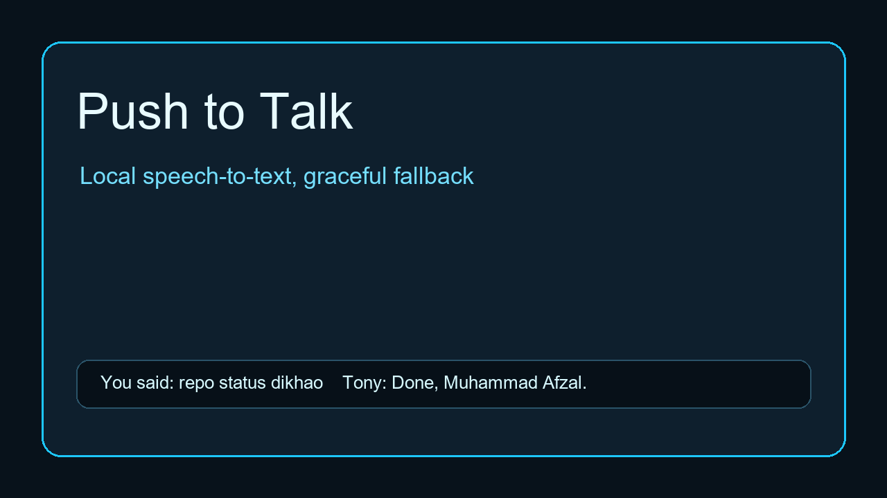
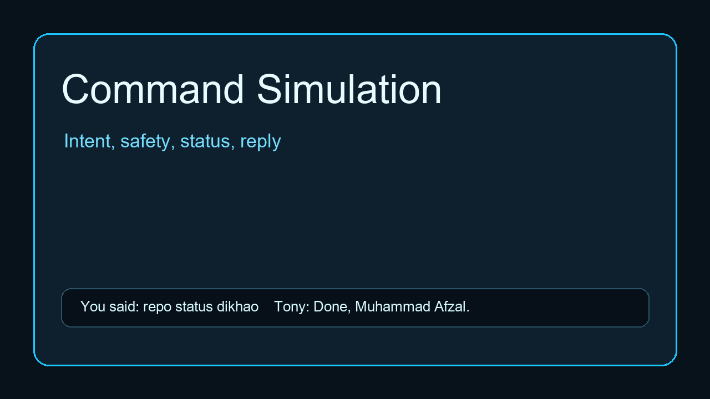
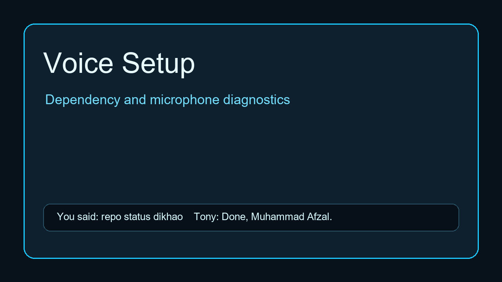

<p align="center">
  
</p>

<h1 align="center">Tony AI</h1>

<p align="center">
  <strong>Local Voice-First Laptop Assistant for Windows</strong><br>
  Aura/Jarvis-style desktop assistant for Muhammad Afzal.
</p>

<p align="center">
  
  
  
  
  
  
  
</p>

## Overview

Tony AI is a free/local Windows laptop assistant with typed commands, push-to-talk voice, wake phrase architecture, project/Git tools, workflow memory, and approval-gated screen awareness. Tony works text-first even if voice dependencies, microphone access, OCR, or optional local AI tools are missing.

Tony does not use paid APIs and does not upload screenshots, recordings, secrets, or workflow memory.

## Features

- Clean PyQt6 assistant UI with command input, Push to Talk, Wake Mode, Stop, and Settings.
- Local speech-to-text foundation with `faster-whisper`, plus graceful fallback.
- Local text-to-speech with `pyttsx3`.
- Mixed English, Urdu, Hindi, Roman Urdu, and Hinglish command normalization.
- Shared `AssistantBrain` pipeline for text, voice, and wake transcripts.
- Safety levels: `SAFE`, `NEEDS_APPROVAL`, and `BLOCKED`.
- Git/project tools for status, diff, analysis, run/test recommendations, and local workflows.
- GitHub CLI helpers that work locally and handle missing `gh`.
- Business/report/prompt drafting only; Tony does not auto-send messages.
- V6 Vision Mode with approval-gated local screenshots.
- Observe Mode and Teach Mode, both approval-first and local-only.
- SQLite memory/logs under `tony/logs/`.
- Release QA scripts, health checks, command simulations, and CI workflow.

## Screenshots

| Dashboard | Voice Mode |
| --- | --- |
|  |  |

| Command Test | Voice Setup |
| --- | --- |
|  |  |

## Demo Commands

```text
repo status dikhao
VS Code kholo
terminal kholo
project analyze karo
git push karo
rm -rf project
.env read karo
client message banao
Tony screen dekho
Tony watch me
Tony workflows dikhao
```

Wake phrases:

```text
Wake Up, Tony!
Wake up Tony, Daddy's Home
```

## Installation

```powershell
python -m venv .venv
.\.venv\Scripts\Activate.ps1
python -m pip install -r requirements.txt
```

Optional local model support:

```powershell
ollama pull qwen3:4b
```

Tony still launches when Ollama is not running.

## Running Tony

```powershell
python run_tony.py
```

Startup greeting:

```text
Welcome back, Muhammad Afzal. Tony is online.
```

## Voice Setup

Voice uses local/free tools:

- `sounddevice` for microphone recording
- `scipy` for WAV writing
- `faster-whisper` for speech-to-text
- `pyttsx3` for text-to-speech

Tony remains usable with typed commands if voice is unavailable. Use Settings -> Check Voice Setup, or run:

```powershell
python scripts/mic_test.py
python scripts/test_voice_transcripts.py
```

## Testing

```powershell
python -m pytest tests
python scripts/health_check.py
python scripts/test_tony_commands.py
python scripts/test_voice_transcripts.py
python scripts/prepare_release.py
python scripts/prepare_pr_summary.py
```

Reports are saved under:

```text
tony/logs/test_reports/
```

## Safety System

Tony asks approval before risky actions such as:

- `git push`, `git commit`, dependency installs
- running project scripts
- screenshots, observe mode, teach mode
- workflow replay, mouse/keyboard control
- GitHub write actions

Tony blocks dangerous/private actions such as:

- `rm -rf`, `del /s`, destructive file actions
- `.env`, API keys, tokens, secrets
- password/OTP/2FA recording
- banking/payment screens
- automatic email/message sending
- force push and reset hard

## Project Structure

```text
tony/
  core/      Assistant brain, safety, memory, workflow context
  tools/     Git, GitHub, project, business, screen, workflow tools
  ui/        PyQt6 desktop interface
  voice/     STT, TTS, wake phrase, voice setup
config/      Settings and permissions
docs/        Safety, commands, release, testing, vision, teach mode
scripts/     QA, release, mic, screenshots, asset generation
tests/       Automated pytest suite
```

## Roadmap

- V1: Text-first local desktop agent
- V2: Push-to-talk voice foundation
- V3: Laptop operator and project runner
- V4: Live voice architecture and local recorders
- V5: GitHub, business, reports, prompts, workflows
- V6: Vision Mode, Observe Mode, Teach Mode, workflow memory
- V7: Workflow editor, safer replay previews, packaged installer

## Release Notes

Current version: `1.0.0`

See [CHANGELOG.md](CHANGELOG.md) and [docs/RELEASE.md](docs/RELEASE.md).

## Contributing

Use real issues and pull requests only. Do not add features that bypass safety, approval, local-only storage, or secret handling rules.

## License

License is currently private/TBD. Add a formal license before public distribution.

## Credits

Built as Tony AI, a local-first Windows assistant for Muhammad Afzal.
